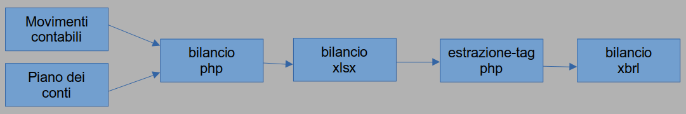

# **Dalla contabilità ordinaria al bilancio formale: soluzione Open Source dell'enigma XBRL**

 **Introduzione**

La contabilità a partita doppia è il fondamento della moderna
ragioneria, basata sul principio che ogni operazione ha un doppio
effetto: un dare e un avere. Per organizzare e classificare le
operazioni in modo sistematico, è essenziale utilizzare un piano dei
conti, una struttura gerarchica che facilita la registrazione,
l\'analisi e la rendicontazione dei dati finanziari.

L'integrazione del piano dei conti in un sistema informatico, come un
database gestibile da software contabili, moltiplica i vantaggi,
permettendo una generazione automatizzata del bilancio e analisi più
approfondite. Questo articolo esplora il legame tra piano dei conti e
partita doppia, i benefici di un piano dei conti ben strutturato e i
vantaggi dell'uso di basi dati integrate per la redazione del bilancio.

Il piano dei conti è un elenco organizzato di conti contabili utilizzati
da un'azienda per registrare le operazioni secondo il metodo della
partita doppia. Ogni conto ha un codice univoco e una descrizione che ne
specifica la funzione (es. \"Cassa\", \"Crediti verso clienti\",
\"Debiti verso fornitori\").

La struttura tipica include:

- Classi (macro-categorie, es. \"Attività\", \"Passività\", \"Costi\",\"Ricavi\")

- Sotto-conti (dettaglio delle voci, es. \"Banca X\", \"Fornitore Y\")

- Livelli gerarchici (per analisi più granulari)

Nella contabilità a partita doppia, ogni transazione viene registrata in
almeno due conti: uno in dare e uno in avere. Il piano dei conti
standardizza le registrazioni, evitando duplicazioni o errori di
classificazione. Facilita l'analisi, raggruppando conti omogenei.
Garantisce coerenza nel tempo e tra diversi reparti aziendali.

I vantaggi del piano dei conti nell'analisi contabile si esplicitano nella classificazione immediata, ogni operazione viene associata a un conto specifico, semplificando la riconciliazione; l'analisi per centri di costo, suddividendo i conti per reparti/progetti, si ottiene un monitoraggio più efficace; La conformità ai principi contabili: Il piano dei conti può essere allineato agli standard imposti per legge.

Inoltre si ottiene l'aggregazione automatica, dunque conti già
predisposti per la creazione di stato patrimoniale e conto economico,
che a sua volta permette l'analisi di bilancio più rapida ben anche
filtri e segmentazioni cioè la possibilità di estrarre dati per singole
voci, costi del personale, costi generali, ecc...

Un piano dei conti inserito in un database centrale permette la gestione
elettronica con grandi benefici in termini di automazione delle
registrazioni quindi minimizzazione dell'errore umano, elaborazione in
tempo reale, nonché la redazione di rapporti personalizzabili per
analisi di supporto all'operatività aziendale. Non ultima
l'interoperabilità che permette la comunicazione con altri sistemi,
quali, per esempio, l'intelligenza artificiale.

Nella pratica quotidiana ogni operazione viene semplificata, registrata,
elaborata in tempo reale con il minimo sforzo da parte dell'operatore
umano anche negli aspetti formativi e professionali. No è più necessario
un contabile a tempo pieno, bensì un operatore con una formazione minima
oppure un professionista di altre professioni che sia disponibile per un
tempo limitato periodicamente.

Infine le aziende che investono in un piano dei conti ben strutturato e
in sistemi informatici integrati ottengono non solo conformità
normativa, ma anche un vantaggio competitivo grazie a una gestione
finanziaria più agile e informata.

**Perché Open Source?**

Nel 2020 in Italia si contano 4 milioni 354 mila imprese attive, cui
corrispondono 17 milioni e 138 mila addetti[^1]. Nel febbraio del 2024
le imprese sono poco oltre 5 milioni[^2]. Il ricambio è caratterizzato
da un forte tasso di natalità e mortalità il che evidenzia il vero
problema delle aziende italiane: la longevità[^3].

Ognuna di queste aziende si deve dotare di un sistema contabile che ogni
anno ha l'obbligo legale di depositare il bilancio. Dal punto di vista
strettamente formale, l'obbligo di depositare il bilancio rappresenta
una nota di serietà e trasparenza che si può solo lodare, dunque una
garanzia in più per clienti e finanziatori in genere. Ciononostante
risulta facile notare l'analogia con il turista che trova luoghi
stupendi per la villeggiatura, ma che non appaiono così meravigliosi per
chi ci vive tutto l'anno. Infatti basta osservare come l'intero
pacchetto del bilancio abbreviato sia composto da 236 fogli contabili
per comprendere quanto la serietà e trasparenza si traduca in
altrettanto carico di lavoro e conseguenti costi per l'azienda.

In questo caso specifico, ma anche i molti altri casi, la possibilità di
accedere a software, strumenti, algoritmi Open Source permette
all'azienda non solo di risparmiare tempo e denaro, ma anche di
mantenere un maggiore controllo dei suoi meccanismi interni, dunque
maggiore consapevolezza delle proprie capacità e limiti.

Open Source crea interazione fra imprese e risorse tecniche, facilita la
creazione di una rete di relazioni, così facendo stabilisce un
ecosistema favorevole allo sviluppo culturale, economico ed operativo.

**Il codice**

Il codice è strutturato in due script in linguaggio PHP, accesso a base
dati MariaDB gestibile attraverso script MySQL, file XML e XLS di
riferimento. I file di riferimento sono estratti dallo strumento
software denominato XBRL_NI_GENERATOR_20181104[^4] che permette il
controllo dei bilanci redatti in formato XBRL, la generazione di XBRL a
partire da XLS e viceversa.

La scelta del linguaggio PHP è dovuta alla facilità di installazione e
gestione in un server Apache. Tale scelta è anche facilitata dalla
presenza della libreria PhpSpreadsheet che possiede funzioni avanzate di
manipolazione dei file XLSX.

Il programma applicativo consta di due file PHP denominati:

-   bilancio.php

-   estrazione-tag.php

Il primo serve al passaggio dalla contabilità al file Excel contenente
tutti i fogli che costituiscono il bilancio, il secondo serve al
passaggio dal file Excel al file XBRL obbligatorio per il deposito del
bilancio presso il registro delle imprese. Il file XBRL deve essere
validato attraverso il servizio online apposito[^5] ed essere firmato
elettronicamente da un dispositivo di firma digitale disponibile nel
mercato, la cui individuazione è bene sia fatta attraverso la camera di
commercio competente per territorio.

Gli script disponibili si riferiscono alla produzione del bilancio
abbreviato. L'approfondimento sui tipi di bilancio rispetto al tipo di
impresa è disponibile nel manuale[^6] distribuito dal registro delle
imprese.

Gli script PHP sono strutturati per funzionare all'interno di un server
in modo che tutte le risorse necessarie siano disponibili nel server e
non nel dispositivo, tipicamente un computer, che richiede il risultato
dell'elaborazione. Ciò si è reso necessario in quanto l'elaborazione
richiede velocità e memoria che possono causare l'interruzione o
addirittura il blocco di altre applicazioni.

Gli script vengono chiamati da comando in linea, vale a dire
direttamente dal terminale, dato che generano file occorre anteporre il
comando sudo, per esempio:

sudo php bilancio.php

esso genera un file Excel dal nome \<data\>\_\<ora\>.xlsx

l'estensione xlsx è dovuta al fatto che le librerie sono aggiornate
all'ultimo standard Excel, cosa che invece non accade con gli strumenti
che il registro delle imprese mette a disposizione degli utenti, i quali
si riferiscono allo standard precedente xls.

Il file xlsx generato sarà il riferimento del secondo script:

sudo php estrazione-tag.php

il quale genera il file bilancio\_\<data\>\_\<ora\>.xbrl che dovrà
essere verificato online prima di essere depositato.

Il flusso di programma è rappresentato nella figura seguente

Sia i movimenti contabili che il piano dei conti provengono dalla base
dati, sono dunque codificati al loro interno. Il codice Open Source
dispone della struttura della tabella relativa ai movimenti contabili,
la sola struttura senza dati per ovvi motivi, mentre il piano dei conti
dispone sia della struttura che i dati. Il tutto in formato SQL per
MariaDB.

Il flusso mostrato in figura è un riferimento teorico, in pratica è
necessario avere un riferimento aggiuntivo che riassuma le regole di
passaggio fra il piano dei conti ed il bilancio, vale a dire le
corrispondenze fra i due documenti.

Per esempio nel foglio Excel "T0002" la voce "A) Crediti verso soci per
versamenti ancora dovuti" corrisponde al codice del Piano dei conti
"12-03-00002". Accade dunque che si procede alla somma algebrica dei
movimenti, nell'anno riferito dal bilancio, che sono stati registrati
con quel codice.

Tale corrispondenza è fattibile per una buona parte delle celle dei
fogli di bilancio, ma non è conveniente adottarla per tutte in quanto i
meccanismi di calcolo interni ad Excel sono disponibili, usarli permette
di evitare un carico di elaborazione fra base dati e movimenti contabili
eccessivo.

A titolo di esempio si osserva, ancora una volta, il foglio Excel
"T0002", la voce "Totale immobilizzazioni (B)" il cui valore si trova
nella cella D17, essa è la somma delle voci seguenti: " I -
Immobilizzazioni immateriali", "II - Immobilizzazioni materiali", "III -
Immobilizzazioni finanziarie", valori in corrispondenza delle celle D14,
D15, D16. La cella D17 conterrà dunque la formula "=D14+D15+D16".

La corrispondenza con il Piano dei conti è effettuata nei vari livelli
di aggregazione, nell'esempio mostrato, il codice"12-03-00002" mostra
l'ultimo livello di aggregazione, vale a dire il singolo codice che non
raggruppa altri codici. Il primo livello, nel caso specifico è "12-", il
quale raggruppa tutti i livelli sottostanti del modello gerarchico.

Per esempio nel foglio Excel "T0006" la voce "1) ricavi delle vendite e
delle prestazioni", valore registrato nella cella D12, quest'ultima
contiene il codice "41-", il programma calcolerà la somma algebrica di
tutti i movimenti che hanno come parte iniziale del codice del Piano dei
conti la notazione "41-".

Può accadere che la corrispondenza richieda il valore negativo della
somma algebrica, in questo caso il codice inizierà con la lettera "n" al
fine di evitare problemi di interpretazione del trattino che separa i
livelli di aggregazione dei codici del Piano dei conti.

La struttura del programma consta delle seguenti cartelle e file:

-   csv
    due file prodotti da estrazione-tag.php strutturati nel modo
    seguente:\
    xlsx\_\<data e ora\>.csv\
    informazioni di base che concorreranno a generare il file xlsx\
    xbrl\_\<data e ora\>.csv\
    informazioni di base che concorreranno a generare il file xbrl\
    La data e ora seguono il formato dmy-His
    (GiornoMeseAnno-OraMinutiSecondi)
-   debug
    file di testo che contiene le informazioni di debug prodotte da
    bilancio.php, vale a dire la registrazione di tutti i passi di
    programma ed in particolare gli errori:\
    \<data\>\_\<ora\>\_debug.txt

-   txt
    file di testo che contengono l'intestazione e le definizioni del
    file xbrl da produrre:\
    xbrl_01.txt, xbrl_03.txt, xbrl_04.txt

-   xbrl
    file xbrl e txt generato da estrazione-tag.php:\
    bilancio\_\<data e ora\>.xbrl\
    contiene il file xbrl da depositare presso il registro delle
    imprese\
    bilancio_errori\_\<data e ora\>.txt\
    file di testo che conterrà gli errori mostrati dal programma
    ufficiale di controllo dei file xbrl, questo file viene riempito
    manualmente.

-   xlsx
    file xlsx prodotto da bilancio.php

-   xml
    file di riferimento per la costruzione del file xbrl:\
    dimension.xml, mapping.xml, report.xml

Nel deposito Github viene aggiunta una cartella con i file SQL che
permettono di generare le tabelle della base dati di riferimento:

-   contab_personia_bilancio_abbreviato_xlsx.sql

-   contab_personia_piano.sql

-   contab_personia_movimenti.sql

l'ultimo file contiene solo la struttura perché si riferisce ai
movimenti contabili.

La libreria essenziale che è necessario installare è PhpSpreadsheet[^7],
la documentazione relativa all'installazione[^8] è esaustiva, gli script
PHP non fanno uso di altre librerie.

Il codice completo di file SQL è pubblicato nel deposito Github dal
quale si può scaricare ed operare un fork. Nonostante il codice sia
sufficiente per la produzione del bilancio aziendale, è disponibile per
migliorie, modifiche ed adattamenti specifici. Inoltre l'azienda
Personia è disponibile ad installazioni personalizzate adatte alle
diverse realtà aziendali, contattare <info@personia.online> a questo
proposito.

[^1]: <https://www.istat.it/storage/ASI/2024/capitoli/C14.pdf>

[^2]: <https://opendata.marche.camcom.it/schede-territoriali.htm>

[^3]: [https://giovanimprenditori.org/news/quale-impresa/generazioni-viaggio-nel-futuro-di-impresa-2/#:\~:text=Altro%20dato%20interessante%3A%20solo%20il,AUB%20sulle%20aziende%20familiari%20italiane](https://giovanimprenditori.org/news/quale-impresa/generazioni-viaggio-nel-futuro-di-impresa-2/#:~:text=Altro dato interessante%3A solo il,AUB sulle aziende familiari italiane)).

[^4]: <https://www.registroimprese.it/deposito-bilanci>

[^5]: <https://tebeni.infocamere.it/teniWeb/jsp/index.jsp>

[^6]: <https://www.unioncamere.gov.it/comunicazione/primo-piano/deposito-dei-bilanci-al-registro-imprese-online-il-manuale-operativo-2024>

[^7]: <https://github.com/PHPOffice/PhpSpreadsheet>

[^8]: <https://phpspreadsheet.readthedocs.io/en/latest/#installation>
